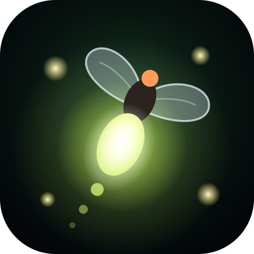
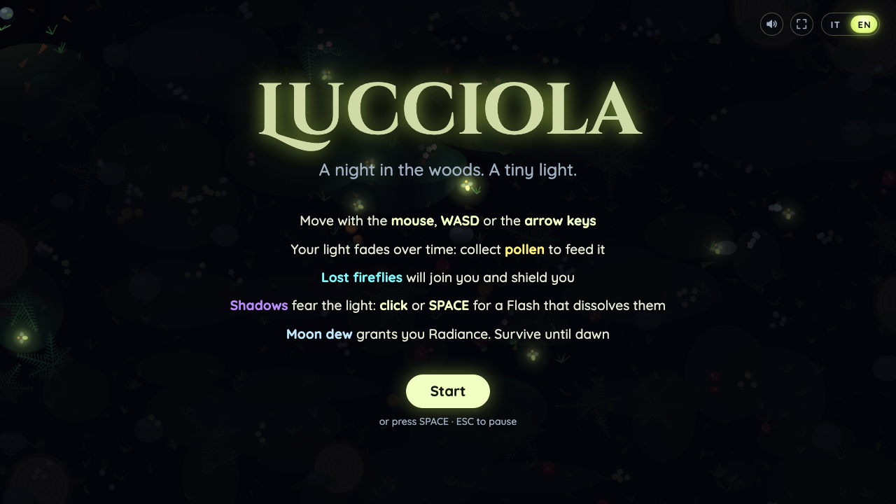
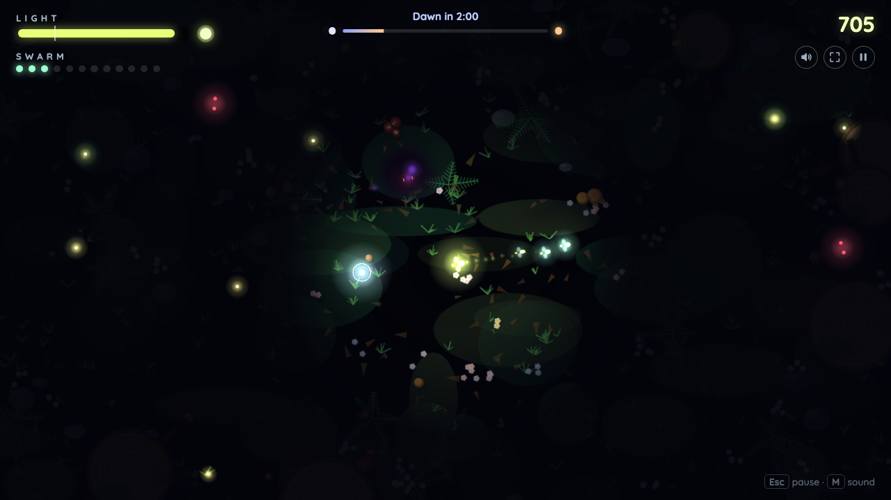

<p align="center">
  
</p>

<h1 align="center">Lucciola</h1>

<p align="center"><em>A night in the woods. A tiny light.</em></p>

<p align="center">
  
</p>

You are a firefly in a pitch-dark forest. Your light is both your sight and your life, and it fades
as the night goes on. Survive until dawn.

- **Pollen** feeds your light; quick pickups climb a musical scale and score more.
- **Lost fireflies** blink in the dark: reach them and they join your swarm, widen your light and
  shield you from hits. Shadows devour them if they get there first.
- **Shadows** are only eyes in the dark; light slows and burns them.
  - *Shade* (red eyes): the common one.
  - *Shadow moth* (violet eyes, from 25 s): small and fragile, zig-zags and dashes.
  - *Colossus* (orange eyes, from 70 s): slow and tough, survives contact, resists the Flash and
    dims your light when close.
- **Waves** of Shadows come from one side at 45, 95 and 128 seconds.
- **Moon dew** grants 7 seconds of *Radiance*: a wider light that does not fade and burns Shadows
  much faster.

Italian and English, generative music, no external assets: every texture and sound is made in code.

<p align="center">
  
  <br>
  <sub>Thirty seconds into a night: a swarm of three, a Moon dew within reach, a Shadow burning at the edge of the light.</sub>
</p>

## Controls

| | Desktop | Touch (landscape) |
|---|---|---|
| Move | mouse, WASD or arrow keys | tap or drag |
| Flash | click or Space | **Flash** button |
| Pause | Esc or P, or the pause button | pause button |
| Sound | M, or the speaker button | speaker button |
| Language | IT / EN toggle in the menu or the pause panel | same |
| Full screen | button in the menu and the HUD, where the browser supports it | same (Android) |

The game pauses by itself when the window loses focus or a phone is turned to portrait.

## Development

Requires Node.js 22.22+, 24.15+ or 26+ (see `engines`; `.nvmrc` pins 24).

```bash
npm install            # also enables the git hooks in .githooks/
npm run dev            # http://localhost:8080
npm run verify         # typecheck, lint, unit tests, build, end-to-end tests
```

| Command | Purpose |
|---|---|
| `npm run dev` / `npm run build` | Dev server / production build into `dist/` |
| `npm run verify:fast` | Typecheck, lint, unit tests (also run by the pre-commit hook) |
| `npm run verify` | Everything: end-to-end tests on desktop, Android and iPhone emulation and on the production build, plus a bundle check |
| `npm run balance` | Seeded bot nights to measure difficulty ([docs/BALANCE.md](docs/BALANCE.md)) |
| `npm run package` | `lucciola-web.zip` ready for itch.io ([docs/DEPLOY.md](docs/DEPLOY.md)) |
| `npm run images` | Regenerate the icon PNGs from `public/logo.svg` and the README screenshots |

Built with Phaser 4 (gameplay), React 19 (interface), TypeScript and Vite, starting from the official
`phaserjs/template-react-ts` template.

## Documentation

- [docs/ARCHITECTURE.md](docs/ARCHITECTURE.md) — modules, frame order, events, persistence
- [docs/TESTING.md](docs/TESTING.md) — test layers, how to write tests, manual checks
- [docs/BALANCE.md](docs/BALANCE.md) — difficulty target and measurements
- [docs/DEPLOY.md](docs/DEPLOY.md) — publishing on itch.io and static hosts
- [docs/ROADMAP.md](docs/ROADMAP.md), [docs/PROGRESS.md](docs/PROGRESS.md),
  [docs/DECISIONS.md](docs/DECISIONS.md) — work tracking
- [CLAUDE.md](CLAUDE.md) — conventions and the work loop for contributors (human or AI)
- [.claude/skills/verify/SKILL.md](.claude/skills/verify/SKILL.md) — how to run the game and observe a
  change like a player

Commits follow [Conventional Commits](https://www.conventionalcommits.org/) in English; the
`commit-msg` hook enforces it.

## License

[MIT](LICENSE) © 2026 Nicola Zorzo. Parts derived from the Phaser template keep their original MIT
notice (© 2025 Phaser Studio Inc).
